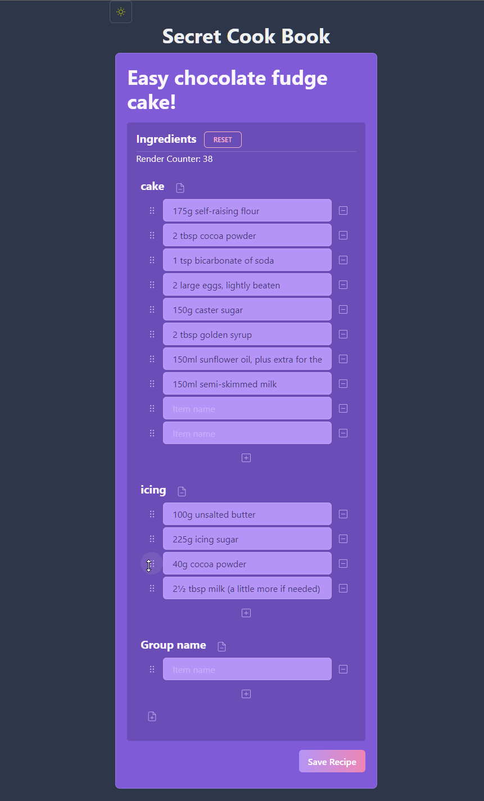

<h1>
Secret Cook Book 👩‍🍳 
</h1>

<h3>
Sample Full Stack Project
</h3>

  
  
  
  
   
  
  
  
   
  

 

<h2>Record, reference and share your personal kitchen secrets.</h2>

_...under construction..._

<h3>
<ul>
<li> Next.js </li>
<li> Next.js REST API Backend</li>
<li> Chakra UI</li>
<li> TailwindCSS</li>
<li> Storybook</li>
<li> React Hook Form</li>
<li> DND-Kit</li>
<li> React Query</li>
<li> Husky</li>
<li> MongoDB + Mongoose + Atlas</li>
<li> Vercel Deployment</li>
</ul>
</h3>

 

 
 

  Secret Cook Book © 2022 by Çağıl Şeker 
Free for non-commercial use with attribution. See the [CC License](https://github.com/cagils/secret-cook-book/blob/dev/LICENSE.md) for details.
