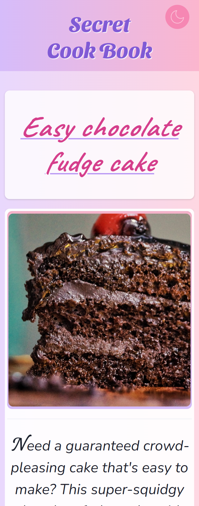
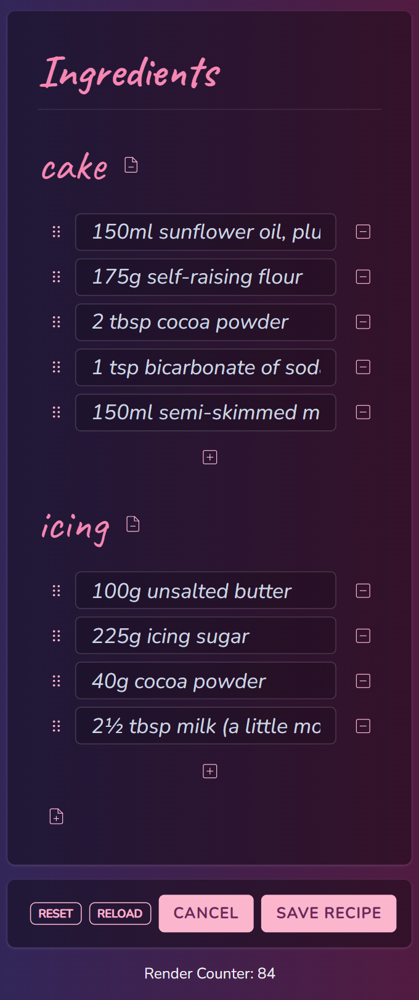

<h1>
Secret Cook Book 👩‍🍳 
</h1>

  
  
  
  
  
  
  
  

<h3>
Sample Next.js MongoDB Full Stack Project
</h3>

 

<h2>Record, reference and share your personal kitchen secrets.</h2>

_...under construction..._

  &nbsp;&nbsp;&nbsp;&nbsp;

  &nbsp;&nbsp;&nbsp;&nbsp;

<h3>
<ul>
<li> Next.js </li>
<li> Chakra UI with optional integrated TailwindCSS</li>
<li> Fully Responsive Design</li>
<li> Jest/Storybook Testing</li>
<li> React Hook Form uncontrolled forms</li>
<li> DND-Kit re-orderable inputs</li>
<li> Next REST API with OpenAPI 3 Schema</li>
<li> Mongoose/MongoDB database</li>
<li> React Query</li>
<li> Husky / SVG</li>
<li> Vercel Deployment</li>
</ul>
</h3>

 

 
 

  Secret Cook Book © 2022 by Çağıl Şeker 
Free for non-commercial use with attribution. See the [CC License](https://github.com/cagils/secret-cook-book/blob/dev/LICENSE.md) for details.
